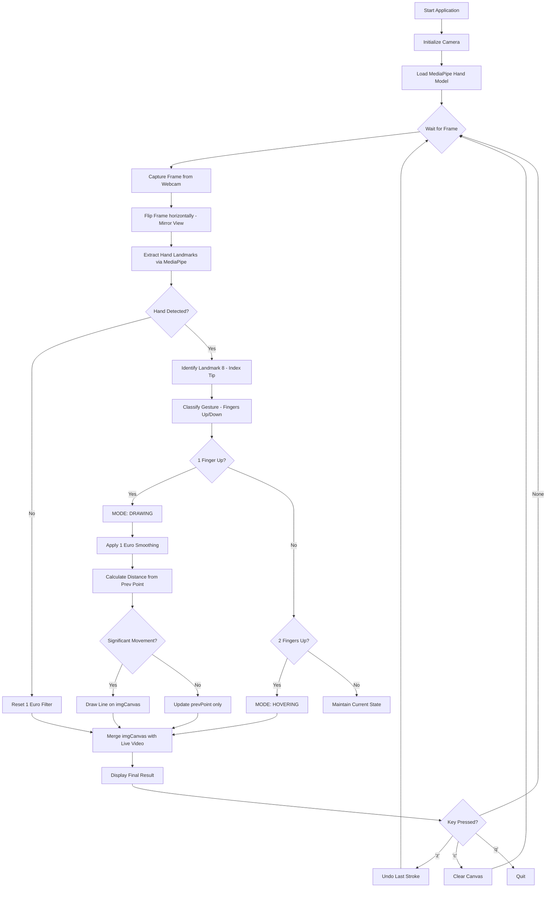

# Project Synopsis: GestureDraw — Next-Gen AI Air Canvas

**Project Name:** GestureDraw (formerly Air Canvas Pro)  
**Developed by:** [Your Name]  
**Technology:** Computer Vision & Deep Learning  

---

## 1. Introduction to Project

### 1.1 Overview
GestureDraw is a state-of-the-art, real-time virtual drawing application that allows users to create digital art in 3D space using natural hand gestures. Unlike traditional drawing software that requires a mouse, stylus, or touch surface, GestureDraw leverages advanced Computer Vision (CV) and Deep Learning (DL) to track hand movements through a standard webcam.

By identifying 21 distinct hand landmarks, the system recognizes specific finger orientations to toggle between "Drawing" and "Hovering" modes. This eliminates the need for physical tracking objects (like colored pens) and makes the system robust across various lighting conditions and environments.

### 1.2 Objectives
*   **Calibration-Free Interaction:** To eliminate the need for manual color calibration (HSV tuning) by using robust neural-network-based hand tracking.
*   **Natural User Interface (NUI):** To create an intuitive "Air Writing" experience where gestures replace traditional input hardware.
*   **High Stability & Accuracy:** To implement sophisticated filtering algorithms (1 Euro Filter) that eliminate hand tremors while preserving fast-stroke responsiveness.
*   **Environmental Robustness:** To ensure the system performs reliably in dim lighting, bright sunlight, and complex backgrounds.
*   **Creative Freedom:** To provide essential digital tools like multi-step Undo, dynamic brush sizing, and instant canvas clearing.

---

## 2. Technology Stack

### 2.1 Programming Language
*   **Python 3.10+**: Chosen for its rich ecosystem in AI/CV and rapid prototyping capabilities.

### 2.2 Core Libraries
*   **OpenCV (Open Source Computer Vision Library):** Used for real-time frame capture, image processing, and rendering the digital canvas.
*   **MediaPipe (Google Research):** Provides the high-fidelity hand landmark detection model, identifying 21 3D coordinates on the hand.
*   **NumPy:** Handles the high-performance matrix operations required for the digital canvas and coordinate calculations.
*   **1 Euro Filter (Implementation):** A custom Python implementation used for adaptive signal smoothing to eliminate jitter.

### 2.3 Development Tools
*   **UV / Pip:** For modern python package management and dependency isolation.
*   **Git/GitHub:** For version control and collaborative development.

---

## 3. System Requirements

### 3.1 Hardware Requirements
*   **Processor:** Apple M-Series (M1/M2/M3) or Intel Core i5/i7 (8th Gen or later).
*   **Camera:** Built-in FaceTime HD camera, External USB Webcam (720p minimum), or iPhone via Continuity Camera.
*   **RAM:** 8GB Minimum (16GB Recommended for smooth 30+ FPS).
*   **GPU:** Integrated GPU with Metal/OpenCL support for MediaPipe acceleration.

### 3.2 Software Requirements
*   **Operating System:** macOS (Sonoma/Ventura recommended), Windows 10/11, or Linux.
*   **Python Environment:** Python 3.10 or higher.
*   **Drivers:** Latest Camera drivers and OpenGL/Metal support.

---

## 4. Flow Diagram

---

## 5. Project Flow

### 5.1 Pre-Processing
The system captures raw video frames and applies a horizontal flip to create a "Mirror" effect, ensuring the user's movements feel natural. Frames are converted to RGB color space for MediaPipe compatibility.

### 5.2 Tracking & Inference
The system feeds frames into the MediaPipe Hand Landmarker. This model identifies 21 landmarks (joints) on the hand. Specifically, the X and Y coordinates of the **Index Finger Tip (Landmark 8)** are extracted as the "Pen Tip."

### 5.3 Gesture Classification (State Machine)
The logic analyzes the Y-positions of fingertips relative to their corresponding PIP joints:
*   **Drawing State:** Triggered when only the Index finger is extended.
*   **Hovering State:** Triggered when both Index and Middle fingers are extended. This allows the user to reposition the "pen" without leaving a mark.

### 5.4 Adaptive Smoothing (1 Euro Filter)
Raw coordinates are passed through a **1 Euro Filter**. This filter adapts its cutoff frequency based on the speed of movement:
*   **Slow Speed:** High smoothing to remove hand tremors during precision drawing.
*   **High Speed:** Low smoothing to prevent "lag" during fast strokes.

### 5.5 Rendering & Interaction
The digital canvas is managed as a persistent NumPy array. Points are connected using `cv2.line` with anti-aliasing (`LINE_AA`) for high visual quality. The final canvas is merged into the live video stream using bitwise operations, making the ink appear as if it is floating in the air.

---

## 6. Conclusion & Future Enhancement

### 6.1 Conclusion
GestureDraw successfully transforms the air into a digital canvas. By migrating from simple color tracking to Deep Learning hand landmarks, the project achieves a high degree of professional accuracy and environmental robustness. The integration of adaptive filters and gesture-based state management provides a user experience that is both stable and intuitive.

### 6.2 Future Enhancements
*   **3D Depth Perception:** Utilizing the Z-coordinate from MediaPipe to implement "pressure sensitivity" or depth-based layering.
*   **Multi-User Canvas:** Implementing networking (WebSockets) to allow two users in different locations to draw on the same shared virtual canvas.
*   **Shape Recognition:** Adding a lightweight neural network to recognize when a user draws a circle, square, or triangle and "snap" them into perfect geometric shapes.
*   **Voice Commands:** Integrating speech recognition (e.g., "Change to Blue," "Eraser Mode") to complement hand gestures.
