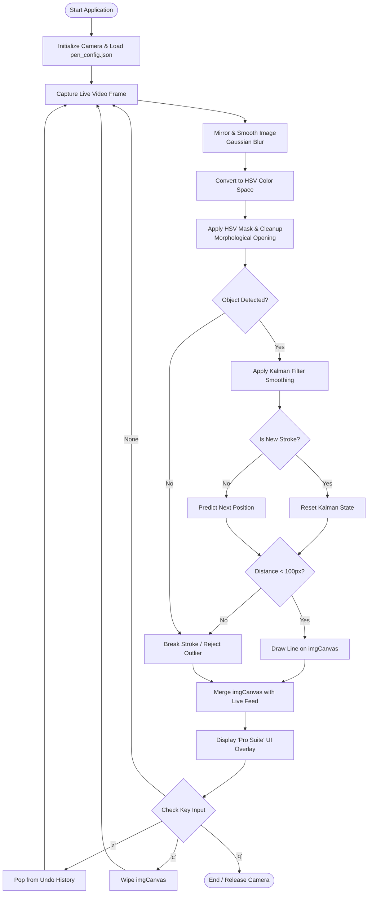

# Project Synopsis: Air Canvas – Real-time Virtual Drawing System

**Student Name:** [Your Name]  
**Project Category:** Computer Vision / Human-Computer Interaction (HCI)  

---

## 1. Abstract
"Air Canvas" is an innovative Human-Computer Interaction (HCI) application that enables users to draw on a digital canvas by moving a physical object in the air. Leveraging the power of Computer Vision through OpenCV, the system tracks specific color markers to record and render spatial movements in real-time. By integrating advanced filtering techniques like Kalman Filters, the project provides a smooth, lag-free artistic experience without requiring expensive hardware or traditional peripherals like mice or touchpads.

## 2. Problem Statement
Traditional digital drawing requires specialized hardware (tablets/styluses) or the use of a mouse, which lacks the natural fluidity of physical drawing. Furthermore, physically impaired users often find traditional peripherals difficult to maneuver. There is a growing need for touchless, intuitive interaction systems that can operate using standard, ubiquitous hardware like webcams.

## 3. Objectives
- To develop a real-time color tracking system using the HSV (Hue, Saturation, Value) color space.
- To implement a persistent digital canvas that stores and displays user input without performance degradation.
- To eliminate hand tremors and camera noise using **Kalman Filter** predictive modeling.
- To provide an intuitive user interface with features like **Multi-step Undo**, **Dynamic Brush Sizing**, and **Automatic Calibration**.

## 4. Methodology
The project follows a modular system architecture:
1.  **Image Pre-processing**: Capturing video frames via webcam, mirroring for intuitive movement, and applying Gaussian Blur to reduce sensor noise.
2.  **Color Segmentation**: Transforming frames to the HSV color space and applying morphological operations (Erosion/Dilation) to isolate the target marker.
3.  **Path Refinement**: Using **Kalman Filters** to predict velocity and smooth the detected coordinates, followed by a distance-threshold filter to reject tracking outliers.
4.  **Canvas Rendering**: Translating spatial coordinates into line segments using OpenCV’s drawing functions on a persistent image buffer.

## 5. Key Features
- **Continuity Camera Support**: Integration with high-definition wireless cameras (e.g., iPhone as webcam).
- **Smooth Stroke Interpolation**: Prevents "dotted" lines during fast movements.
- **Advanced State Recovery**: Snapshot-based undo system allowing users to revert up to 10 strokes.
- **Dynamic UX**: Real-time brush resizing and status overlays (FPS, Brush Size, and History count).

## 6. Software & Hardware Requirements
- **Hardware**: Standard 720p/1080p Webcam, Colored Tracking Object (Neon marker/cap).
- **Software**: Python 3.x, OpenCV-Python, NumPy.
- **Environment**: macOS/Windows/Linux with `uv` package management.

## 7. Future Scope
- **Hand Landmark Detection**: Transitioning from color-based tracking to AI-powered hand gesture recognition using MediaPipe.
- **3D Air Drawing**: Integrating depth sensors (like LiDAR) to draw in a 3D volumetric space.
- **Collaborative Canvas**: Using WebSockets to allow multiple users to draw on the same canvas remotely.

## 8. System Flowchart
The following diagram illustrates the logical flow of the system, from hardware interaction to mathematical filtering and visual rendering:

## 9. Conclusion
The Air Canvas project demonstrates the potential of Computer Vision to create accessible and intuitive software. By combining basic image processing with advanced mathematical filters, it provides a robust platform for digital art and touchless interaction, proving that sophisticated HCI applications can be built using standard consumer hardware.
